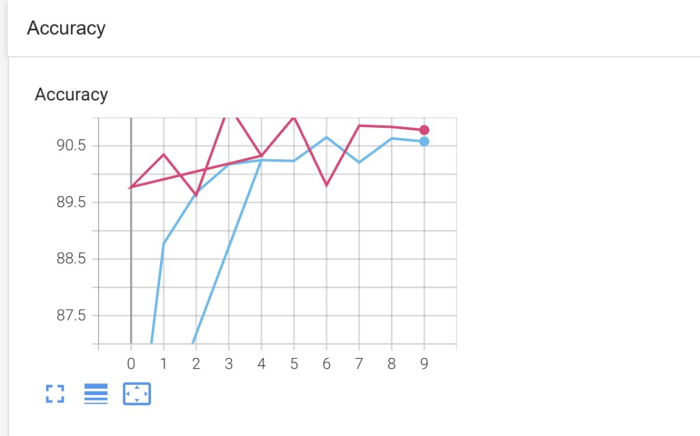
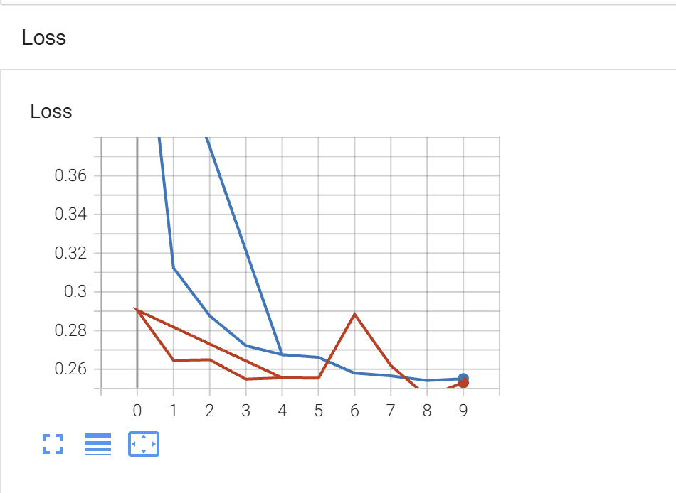
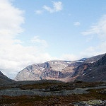

# Intel Görüntü Sınıflandırma - ResNet18 Transfer Learning

Bu projede PyTorch kullanılarak Transfer Learning yöntemi ile doğal sahne görüntü sınıflandırması yapılmıştır. Model olarak önceden eğitilmiş (pretrained) ResNet18 kullanılmıştır.

## Veri Seti

Projede [Kaggle — Intel Image Classification](https://www.kaggle.com/datasets/puneet6060/intel-image-classification) veri seti kullanılmıştır.

**Train** ve **test** görsellerini bu linkten indirebilirsiniz. İndirdikten sonra klasörleri şu yapıda yerleştirin:

```text
images/intel image/seg_train/seg_train/
images/intel image/seg_test/seg_test/
```

`seg_pred` yalnızca yerel tahmin örnekleri içindir; GitHub'a yüklenmez.

**Sınıflar:**

- Buildings
- Forest
- Glacier
- Mountain
- Sea
- Street

## Kullanılan Teknolojiler

- Python
- PyTorch
- Torchvision
- TensorBoard
- Transfer Learning
- ResNet18

## Proje Yapısı

```text
images/
└── intel image/
    ├── seg_train/
    ├── seg_test/
    └── seg_pred/

assets/
├── accuracy.png
├── loss.png
└── samples/
    ├── 10004.jpg
    ├── 10005.jpg
    └── 10012.jpg

main.py
README.md
requirements.txt
```

## Transfer Learning

Projede ImageNet üzerinde eğitilmiş ResNet18 modeli kullanılmıştır.

Özellik çıkarımı (feature extraction) katmanları dondurulmuştur:

```python
for param in model.parameters():
    param.requires_grad = False
```

Son katman değiştirilerek 6 sınıflı hale getirilmiştir:

```python
model.fc = nn.Sequential(
    nn.Linear(in_features=512, out_features=6, bias=True)
)
```

Sadece son katman eğitilmiştir.

## Eğitim Sonuçları

10 epoch eğitim sonunda gözlemlenen **en yüksek doğruluk** ve **en düşük kayıp** değerleri (TensorBoard):

| Metrik | En iyi değer |
|--------|----------------|
| Train Accuracy (max) | %90.8 |
| Test Accuracy (max) | %90.6 |
| Train Loss (min) | 0.255 |
| Test Loss (min) | 0.25 |

| Metrik | Sonuç |
|--------|-------|
| Train Accuracy | %84.11 |
| Test Accuracy | %89.77 |
| Train Loss | 0.48 |
| Test Loss | 0.29 |

## TensorBoard Sonuçları

TensorBoard kullanılarak eğitim ve test metrikleri görselleştirilmiştir.

### Accuracy



### Loss



TensorBoard'u yerelde açmak için:

```bash
tensorboard --logdir=runs
```

## Örnek Tahmin Görselleri

`seg_pred` klasöründen yalnızca şu üç görüntü kullanılır: **10004**, **10005**, **10012**.

**10004.jpg**


**10005.jpg**



**10012.jpg**


Tahminleri çalıştırmak için `main.py` dosyasının sonundaki döngüyü kullanın; çıktıda her görüntü için tahmin edilen sınıf yazdırılır.
